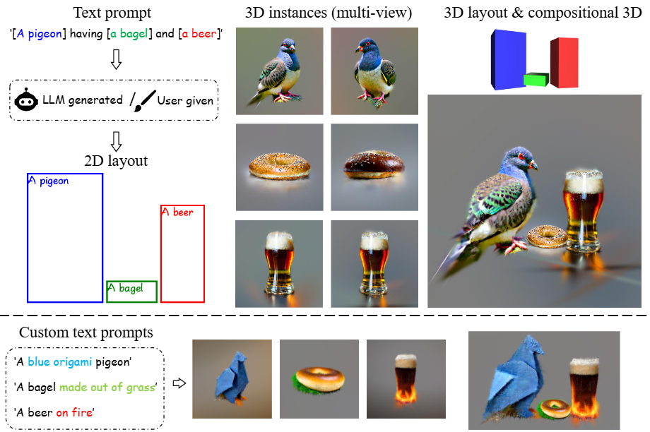
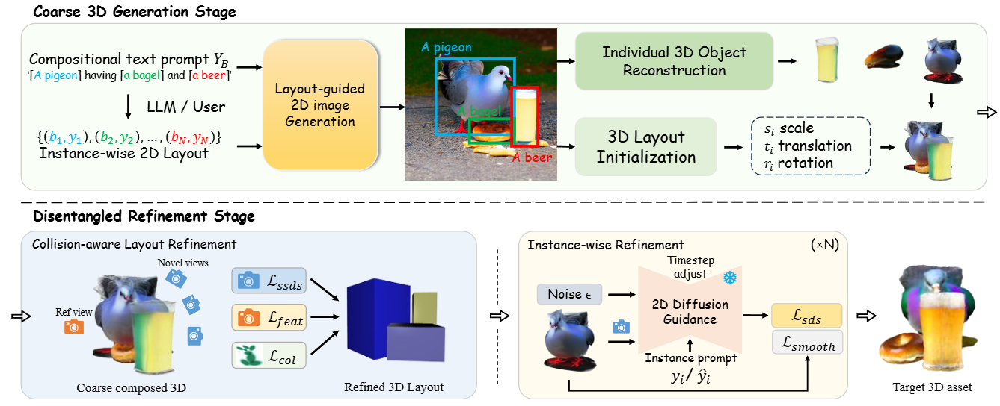

# Layout-Your-3D: Controllable and Precise 3D Generation with 2D Blueprint
[Junwei Zhou](https://github.com/Colezwhy)1,[Xueting Li](https://sunshineatnoon.github.io/)2,[Lu Qi](http://luqi.info/)3, [Ming-Hsuan Yang](https://faculty.ucmerced.edu/mhyang/)3,4

1  Huazhong University of Science and Technology, 2  NVIDIA, 3  Wuhan University, 
4 Insta360 Research, 5 UC Merced, 6 Yonsei University

Official implementation for paper 'Layout-Your-3D: Controllable and Precise 3D Generation with 2D Blueprint'.

## Overview
    

    
Given a text prompt describing multiple objects and their 2D spatial relationships, our method generates a 3D scene depicting these objects naturally interacting with one another. Also, Layout-Your-3D supports instance-wise attributes editing and customization, which opens up new possibilities for compositional 3D generation.  

***Check out our [website](https://colezwhy.github.io/layoutyour3d/) and [paper](https://arxiv.org/abs/2410.15391) for more results!***

## Method

